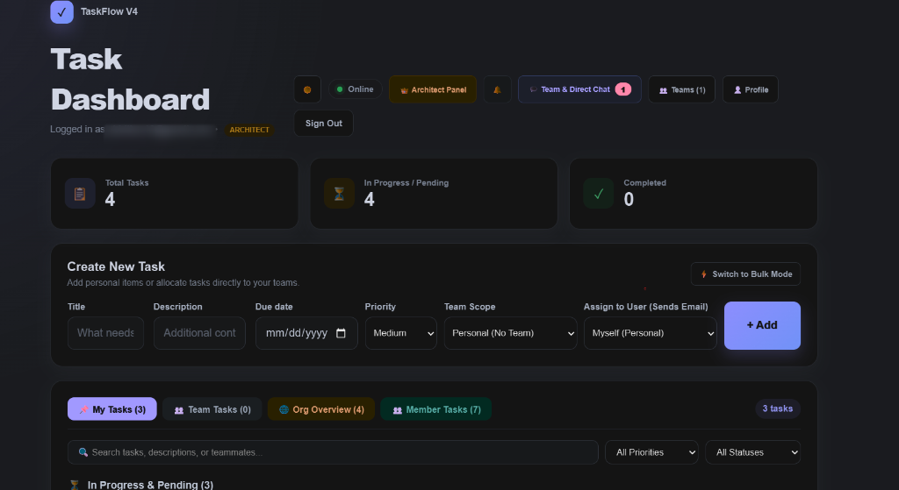
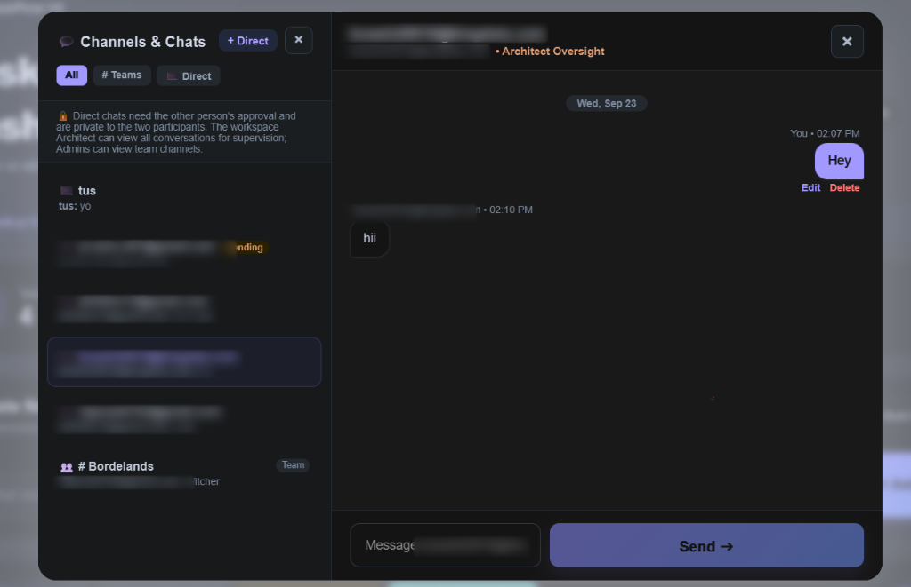
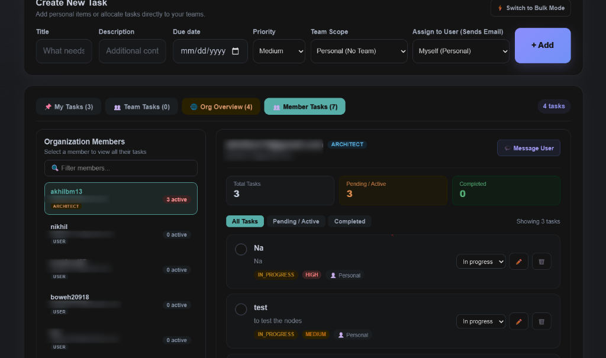
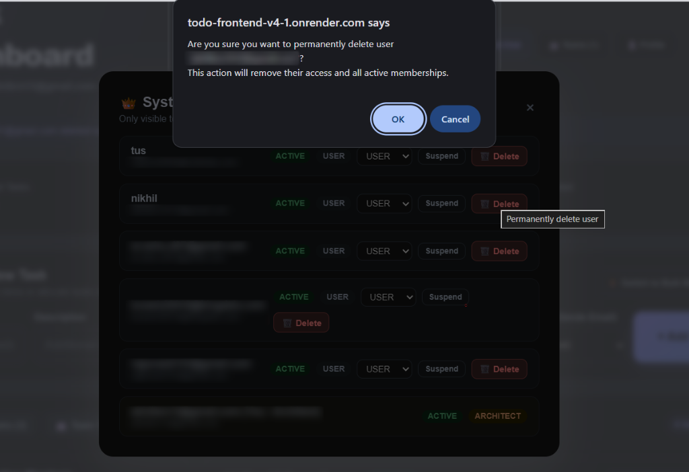
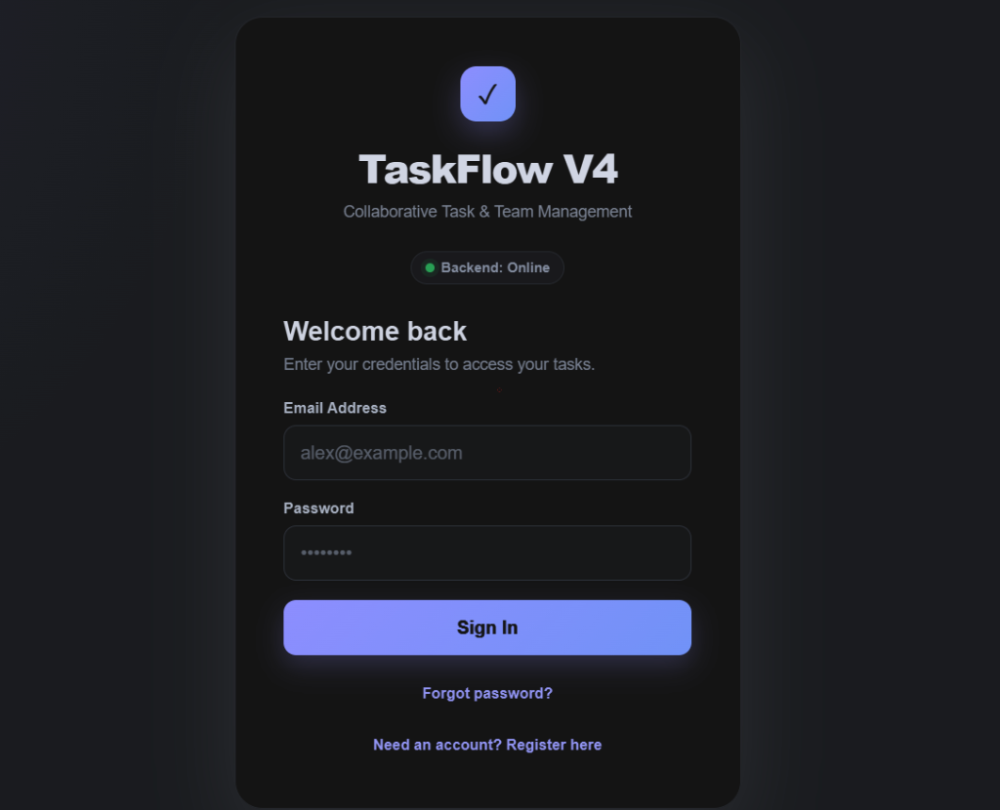
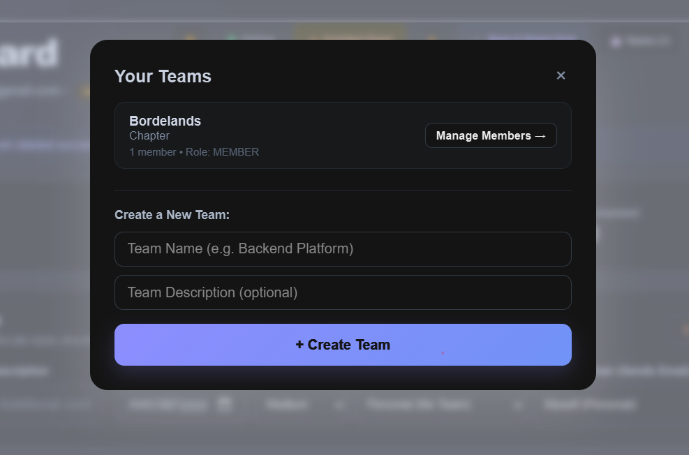
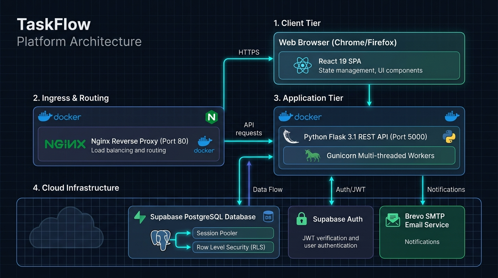
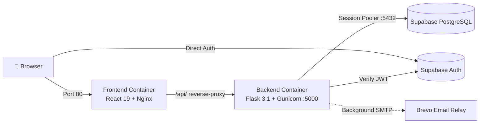

# ✅ TaskFlow V4.9.2 — Collaborative Task, Team & Chat Platform

[](https://todo-frontend-v4-1.onrender.com/)
[](https://hub.docker.com/r/akhilbm/todo-backend)
[](https://hub.docker.com/r/akhilbm/todo-frontend)
[](https://python.org)
[](https://react.dev)
[](https://supabase.com)
[](https://brevo.com)

A modern, containerized full-stack task management and team collaboration platform built with **React 19**, **Flask 3.1**, **Gunicorn**, **Supabase PostgreSQL & Auth**, **Brevo SMTP**, **Docker**, and **Nginx**.

🌐 **Live Demo Application**: [https://todo-frontend-v4-1.onrender.com/](https://todo-frontend-v4-1.onrender.com/) *(Free tier instances auto-wake in ~30s on first load)*

Deployable on **localhost**, **AWS EC2**, **Render**, or **Azure**.

---

## 📑 Contents

1. [What is TaskFlow?](#-what-is-taskflow)
2. [Application Showcase](#-application-showcase)
3. [Architecture Overview](#-architecture-overview)
4. [Deployment Paths](#-choose-your-deployment-path)
5. [Quick Start — Run Locally](#-quick-start--run-locally)
6. [Docker Hub Images](#-docker-hub-images)
7. [Environment Variables](#-environment-variables)
8. [Automated Audit & Verification](#-automated-audit--verification)
9. [Documentation Index](#-documentation-index)
10. [Troubleshooting](#-troubleshooting)

---

## 🧭 What is TaskFlow?

| Feature | Capabilities |
|:---|:---|
| **📋 Tasks & Deadlines** | Personal & team tasks, priority levels, due dates with overdue warning pills, status transitions, search, and bulk task creation (up to 10 at once). |
| **👥 Teams & Workspaces** | Collaborative teams, member invitations by email, dedicated **👥 Member Tasks** workload view, Leader & Member permissions, and task claiming. |
| **💬 Direct Messages & Channels** | Team channels and 1-on-1 direct messages with recipient approval flow (`ACCEPTED`, `PENDING_ACCEPTANCE`, `REJECTED`), message editing, soft-deletion, and unread badges. |
| **🔔 Smart Notifications** | Collapsed notification threads (1 unread alert per chat), deep-link navigation directly into tasks or chats, and optional Brevo transactional emails. |
| **👑 Architect Panel** | Multi-tier role governance (`ARCHITECT` &rarr; `ADMIN` &rarr; `USER`), user suspension/activation, and instant Supabase auth session revocation. |
| **⚡ Cloud Resilience** | Automatic backend wake-up ping for sleeping free-tier servers, retry on 502/504, Nginx reverse-proxying, and zero CORS issues. |

---

## 📸 Application Showcase

| **Task Dashboard** | **Direct & Team Chat** |
|:---:|:---:|
|  |  |

| **Organization & Member Workloads** | **Architect Administration Panel** |
|:---:|:---:|
|  |  |

| **Authentication & Access** | **Team Workspace Management** |
|:---:|:---:|
|  |  |

---

## 🏗 Architecture Overview





- **Frontend Container**: Nginx serves the compiled React 19 single-page app and proxies `/api/*` to the backend. The browser only communicates through port `80`.
- **Backend Container**: Python Flask API managed by Gunicorn. Boot-time database synchronization creates and patches tables automatically.
- **Supabase**: Managed PostgreSQL database (connected via Session pooler on port 5432) + Supabase Auth.
- **Brevo SMTP**: Asynchronous worker thread sends transactional notifications for assignments, invitations, and chat alerts.

---

## 🚀 Choose Your Deployment Path

Complete **[docs/SUPABASE_SETUP.md](docs/SUPABASE_SETUP.md)** first (takes ~10 minutes).

| Target Environment | Guide | Best For |
|:---|:---|:---|
| 💻 **Local Machine** | [Quick Start Below](#-quick-start--run-locally) | Development, testing |
| 🟠 **AWS EC2** | [docs/DEPLOY_AWS.md](docs/DEPLOY_AWS.md) | Standard production cloud server *(No ECR required!)* |
| 🟣 **Render** | [docs/DEPLOY_RENDER.md](docs/DEPLOY_RENDER.md) | Easy Git-push deployments (Free tier supported) |
| 🔵 **Azure** | [docs/DEPLOY_AZURE.md](docs/DEPLOY_AZURE.md) | Azure VM or Azure Container Apps |
| 🐳 **Docker Hub** | [docs/DOCKER_HUB.md](docs/DOCKER_HUB.md) | Pulling or publishing custom Docker images |

---

## 💻 Quick Start — Run Locally

### Requirements
- [Git](https://git-scm.com/downloads)
- [Docker Desktop](https://www.docker.com/products/docker-desktop/) (running)

### 1. Clone & Setup Environment
```bash
git clone https://github.com/AkhilNikhil/taskflow.git
cd taskflow
cp .env.example .env
```
Open `.env` and enter your Supabase connection strings from [SUPABASE_SETUP.md](docs/SUPABASE_SETUP.md).

### 2. Launch Containers (Choose ONE Method)

#### Method A: Build from Source (Recommended for custom Supabase projects)
```bash
docker compose up -d --build
```

#### Method B: Pull Ready-Made Images from Docker Hub
```bash
docker compose -f docker-compose.hub.yml pull
docker compose -f docker-compose.hub.yml up -d
```

### 3. Access TaskFlow
- **Web App**: [http://localhost](http://localhost)
- **Backend Health Check**: [http://localhost:5000/api/health](http://localhost:5000/api/health)
- **First Login (Become Architect)**: Click **Register**, enter the email specified in `ROOT_ARCHITECT_EMAIL`, confirm your email, and sign in to access the **👑 Architect Panel**.

---

## 🐳 Docker Hub Images

| Service | Image | Default Port |
|:---|:---|:---:|
| Backend API | `akhilbm/todo-backend:v4.9.2` (`latest`) | `5000` |
| Frontend Web | `akhilbm/todo-frontend:v4.9.2` (`latest`) | `80` |

---

## 🔧 Environment Variables

Stored in `.env` locally, or configured in your cloud provider's dashboard:

### Backend
| Variable | Required | Description |
|:---|:---:|:---|
| `DATABASE_URL` | ✅ | Supabase **Session pooler** URI (`postgresql://...:5432/postgres`) |
| `SUPABASE_URL` | ✅ | Supabase Project URL (`https://<project-ref>.supabase.co`) |
| `SUPABASE_ANON_KEY` | ✅ | Supabase Public Anon Key |
| `ROOT_ARCHITECT_EMAIL` | ✅ | Super-admin email (`you@example.com`; auto-promoted to Architect on first signup) |
| `FRONTEND_URL` | Cloud | Public frontend URL (e.g. `http://<EC2_IP>` or `https://app.onrender.com`) |
| `CORS_ORIGINS` | Cloud | Same as `FRONTEND_URL` |
| `RUN_SCHEMA_SYNC` | Optional | Auto-creates and migrates database tables on boot (`true`) |
| `SMTP_*` | Optional | Brevo SMTP credentials for notification emails |

### Frontend
| Variable | Scope | Description |
|:---|:---:|:---|
| `BACKEND_URL` | **Runtime (Required)** | Upstream backend address for Nginx proxy (e.g. `http://backend:5000`) |
| `VITE_SUPABASE_URL` | Build-time | Supabase project URL |
| `VITE_SUPABASE_ANON_KEY` | Build-time | Supabase anon key |

---

## 🧪 Automated Audit & Verification

TaskFlow includes an automated end-to-end verification suite in [test_audit.py](test_audit.py):

```bash
docker compose exec backend python test_audit.py
```
*Tests 26 functional assertions across auth sync, user roles, teams, task assignment, DM approval, notifications, and schema sync.*

---

## 📚 Documentation Index

- [docs/SUPABASE_SETUP.md](docs/SUPABASE_SETUP.md) — 10-minute Supabase & Brevo setup
- [docs/DEPLOY_AWS.md](docs/DEPLOY_AWS.md) — AWS EC2 & App Runner deployment
- [docs/DEPLOY_RENDER.md](docs/DEPLOY_RENDER.md) — Render Web Services deployment
- [docs/DEPLOY_AZURE.md](docs/DEPLOY_AZURE.md) — Azure VM & Container Apps deployment
- [docs/DOCKER_HUB.md](docs/DOCKER_HUB.md) — Pre-built images & custom publishing
- [docs/api.md](docs/api.md) — Comprehensive REST API documentation
- [docs/v4-architecture.md](docs/v4-architecture.md) — In-depth architectural blueprint

---

## 🩺 Troubleshooting

| Issue | Resolution |
|:---|:---|
| **Waking up backend... banner** | Free cloud instances sleep after 15m of inactivity. The frontend auto-pings the backend and reconnects within ~30–60 seconds. |
| **`BACKEND_URL is not set` error** | Ensure the frontend container has the `BACKEND_URL` environment variable configured. |
| **Database connection timeout / IPv6 errors** | Ensure you are using the **Session pooler** URI from Supabase (`aws-0-....pooler.supabase.com:5432`), not the Direct connection string. |
| **Verification email redirects to localhost** | In Supabase &rarr; **Authentication &rarr; URL Configuration**, update **Site URL** to your real production address. |
