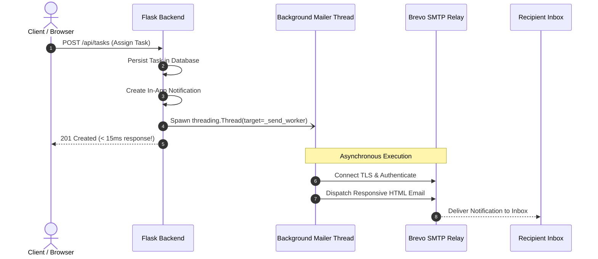

# TaskFlow V4 – Application Architecture Reference

> **System Version:** V4.5 (Enterprise Release)  
> **Frontend:** React 19, Vite, TailwindCSS / Custom Modern UI, Nginx (Alpine)  
> **Backend:** Python 3.12, Flask 3.1, Gunicorn 26.2, SQLAlchemy 2.0  
> **Database:** PostgreSQL (Hosted on Supabase Cloud, UUID Primary Keys)  
> **Authentication:** Supabase Auth (JWT & Cloud Email Verification)  
> **Email Pipeline:** Brevo SMTP Relay (Asynchronous Multi-Threaded, Dynamic URL Host)  
> **Containerization:** Docker, Docker Compose, Multi-Stage Builds, Nginx Reverse Proxy (Render & AWS EC2 Ready)  

---

## 1. System Overview

**TaskFlow V4** transforms the application from a personal task manager into an enterprise-grade, multi-tenant collaboration and task management platform. V4 introduces role-based governance, team collaboration spaces, dual-scope task assignment, real-time messaging, and an asynchronous transactional email pipeline powered by Brevo SMTP.

### Core Architectural Principles
1. **Decoupled Identity & Authentication**: User credentials and password hashes are delegated entirely to Supabase Auth. The application database stores zero passwords.
2. **Tab-Isolated Multi-Account Testing**: Uses `window.sessionStorage` so that multiple accounts (Architect, Admin, User) can be tested simultaneously across browser tabs without session cross-contamination.
3. **Zero-Latency Transactional Notifications**: Action-based transactional emails are processed via asynchronous background threading, ensuring HTTP API response times remain under 15ms.
4. **Port 80 Reverse Proxy Architecture**: Nginx serves the React SPA and reverse-proxies all `/api/*` traffic to the backend internally. This eliminates CORS overhead and eliminates the need to expose the backend port (5000) to the public internet.

---

## 2. High-Level Architecture Diagram

```mermaid
flowchart TD
    subgraph ClientLayer [Client & Access Layer]
        Browser["Web Browser (React 19 SPA)"]
        SessionStorage["Tab-Isolated SessionStorage\n(Architect / Admin / User)"]
        Browser <--> SessionStorage
    end

    subgraph ContainerStack [Production Docker Stack (Port 80)]
        Nginx["Nginx Web Server :80\n(Reverse Proxy & Static SPA Host)"]
        Gunicorn["Gunicorn WSGI Server :5000\n(2 Workers, 4 Threads)"]
        Flask["Flask 3.1 REST API\n(Application Logic & Blueprints)"]
        AsyncThread["Background Mailer Thread\n(threading.Thread, non-blocking)"]

        Nginx -->|Static Assets /| Browser
        Browser -->|HTTP Requests :80| Nginx
        Nginx -->|Internal Proxy /api/| Gunicorn
        Gunicorn --> Flask
        Flask -->|Dispatch Task / Message| AsyncThread
    end

    subgraph CloudServices [External Cloud Infrastructure]
        SupabaseAuth["Supabase Auth Service\n(JWT Issuance & Email Tokens)"]
        SupabaseDB[("Supabase PostgreSQL Database\n(10 Relational Entities)")]
        BrevoSMTP["Brevo SMTP Relay\n(smtp-relay.brevo.com:587)"]
        Recipient["Recipient Email Inbox\n(Gmail / Corporate Email)"]

        Browser -->|Auth SDK (Sign in/up)| SupabaseAuth
        Flask -->|JWT Verification| SupabaseAuth
        Flask -->|SQLAlchemy / SSL| SupabaseDB
        AsyncThread -->|STARTTLS / Port 587| BrevoSMTP
        BrevoSMTP -->|Transactional Delivery| Recipient
    end
```

---

## 3. Role Hierarchy & Governance

TaskFlow V4 implements a two-tier role system: **System Roles** (platform-wide authority) and **Team Roles** (workspace collaboration scope).

```text
               +----------------------------------+
               |        SYSTEM ARCHITECT          |
               |       (akhilbm13@gmail.com)      |
               |  - Unrestricted global oversight |
               |  - Sole authority to promote Admins
               +----------------+-----------------+
                                |
               +----------------v-----------------+
               |          SYSTEM ADMIN            |
               |  - Organization-wide oversight   |
               |  - Cannot alter Architect role   |
               +----------------+-----------------+
                                |
               +----------------v-----------------+
               |          STANDARD USER           |
               |  - Default self-signup role      |
               +----------------------------------+
```

### 3.1 System Roles
* **`ARCHITECT`**: The top-level administrative authority. Initially assigned to `akhilbm13@gmail.com`. Holds transparent, unrestricted visibility across all organizational teams, channels, tasks, and audit logs without membership constraints. Only the Architect can promote users to Admin or demote Admins.
* **`ADMIN`**: Platform administrators responsible for organization-wide oversight, user status management, and sensitive workflow operations. Admins cannot alter the Architect's permissions or promote other users to Admin.
* **`USER`**: Default role assigned to all newly registered accounts. Standard users manage their personal tasks and participate in teams they are invited to.

### 3.2 Team Roles
Team roles operate independently of system roles:
* **`LEADER`**: Manages team settings, invites members, assigns or reassigns team tasks, and acts as the designated email recipient when tasks are assigned to the team as a whole.
* **`MEMBER`**: Standard team participant. Can view team tasks, claim open tasks, contribute to team conversation channels, and mark assigned work as complete.

---

## 4. Relational Data Model (10 Entities)

The database runs on PostgreSQL hosted externally on Supabase Cloud.

```text
+-------------------+       +--------------------+       +---------------------+
|      users        | 1   * |    team_members    | *   1 |        teams        |
|-------------------|-------|--------------------|-------|---------------------|
| id (UUID, PK)     |       | user_id (FK)       |       | id (UUID, PK)       |
| email (VARCHAR)   |       | team_id (FK)       |       | name (VARCHAR)      |
| system_role       |       | team_role (LEADER) |       | description (TEXT)  |
| account_status    |       +--------------------+       | created_by (FK)     |
+---------+---------+                                    +----------+----------+
          | 1                                                       | 1
          |                                                         |
          | *                                                       | *
+---------v---------+                                    +----------v----------+
|       tasks       |<-----------------------------------+    conversations    |
|-------------------|                                    |---------------------|
| id (UUID, PK)     |                                    | id (UUID, PK)       |
| title (VARCHAR)   |                                    | type (TEAM/DIRECT)  |
| description (TEXT)|                                    | team_id (FK, opt)   |
| priority (PRIO)   |                                    +----------+----------+
| status (STATUS)   |                                               | 1
| creator_id (FK)   |                                               |
| assigned_user_id  |                                               | *
| assigned_team_id  |                                    +----------v----------+
+-------------------+                                    |      messages       |
                                                         |---------------------|
                                                         | id (UUID, PK)       |
                                                         | conversation_id(FK) |
                                                         | sender_id (FK)      |
                                                         | content (TEXT)      |
                                                         +---------------------+
```

### Entity Responsibilities
1. **`users`**: Profiles synchronized directly with `auth.users.id`. Stores email, display metadata, `system_role` (`ARCHITECT`, `ADMIN`, `USER`), and `account_status` (`ACTIVE`, `SUSPENDED`).
2. **`teams`**: Organizational collaborative units with unique names and descriptions.
3. **`team_members`**: Junction entity linking users to teams with specific roles (`LEADER` or `MEMBER`).
4. **`tasks`**: Extended task entity supporting dual assignment (both `assigned_team_id` and `assigned_user_id` can be populated simultaneously).
5. **`notifications`**: In-app notifications with event types (`TASK_ASSIGNED`, `TEAM_INVITE`, `MESSAGE`, etc.) and read/unread flags.
6. **`conversations`**: Communication channels categorised as either `TEAM` (shared by all team members) or `DIRECT` (private 1-on-1).
7. **`conversation_members`**: Tracks active participants and last-read timestamps per channel.
8. **`messages`**: Text messages sent within conversations with sender references.
9. **`approval_requests`**: Approval workflow gates for sensitive operations.
10. **`audit_logs`**: Immutable security log recording actor, action, entity, and timestamp.

---

## 5. Tab-Isolated Multi-Account Session Management

Testing complex multi-tenant systems typically requires opening multiple incognito windows or different browsers. TaskFlow V4 solves this natively via **Tab-Isolated Session Storage**:

```text
Browser Tab 1 (Architect)       Browser Tab 2 (Admin)          Browser Tab 3 (User)
+-----------------------+     +-----------------------+     +-----------------------+
|  window.sessionStorage|     |  window.sessionStorage|     |  window.sessionStorage|
|  akhilbm13@gmail.com  |     |  user000@gmail.com    |     |  u1@gmail.com         |
|  Role: ARCHITECT      |     |  Role: ADMIN          |     |  Role: USER           |
+-----------------------+     +-----------------------+     +-----------------------+
           |                              |                              |
           v                              v                              v
   Global Task View             Team Management                Personal Tasks & Chat
```

* **Session Storage Isolation**: By passing `storage: window.sessionStorage` into the Supabase JavaScript client, each tab maintains an isolated authentication state.
* **Smooth F5 Reload**: Refreshing an active tab preserves authentication state without screen flicker or returning to the login form.
* **Auto-Purge on Browser Close**: Closing the browser window purges all tokens, guaranteeing a secure login prompt on the next session.

---

## 6. Asynchronous Action-Based Transactional Email Pipeline

The email pipeline is powered by **Brevo SMTP Relay** (`smtp-relay.brevo.com:587`). To ensure the user interface never hangs on slow SMTP handshakes, emails are dispatched asynchronously via background threading.



### Anti-Spam Notification Rules
To prevent notification fatigue, emails are triggered strictly on high-value business events:
* **Direct User Assignment**: When a task is assigned to an individual user, that user receives an email notification with direct links.
* **Team-Only Assignment**: When a task is assigned to a team without an individual owner, the **Team Leader** receives the email alert to triage the task, while all team members receive an in-app bell notification.
* **Direct 1-on-1 Messages**: The recipient receives an instant email alert containing the sender's name and message preview.
* **Team Invitations**: Newly invited team members receive an invitation email.

---

## 7. Container Network & Reverse Proxy Architecture

In V3, the frontend container made direct cross-origin calls to the backend on port `5000`, requiring CORS configurations and exposing port `5000` on public servers. 

**V4 upgrades this to a unified Port 80 Reverse Proxy:**

```text
Incoming Traffic (HTTP :80)
          |
          v
+-------------------------------------------------------------+
| FRONTEND CONTAINER (Nginx on Port 80)                       |
|                                                             |
|   location /api/ {                                          |
|       proxy_pass http://backend:5000;                       |
|       proxy_set_header Host $host;                          |
|       proxy_set_header X-Real-IP $remote_addr;              |
|   }                                                         |
|                                                             |
|   location / {                                              |
|       root /usr/share/nginx/html;                           |
|       try_files $uri $uri/ /index.html;                     |
|   }                                                         |
+------------------------------+------------------------------+
                               |
                               | (Internal Docker Network)
                               v
+-------------------------------------------------------------+
| BACKEND CONTAINER (Gunicorn on Port 5000)                   |
| - Running as non-root 'appuser'                             |
| - 2 Workers, 4 Threads                                      |
| - Health Check: /api/health                                 |
+-------------------------------------------------------------+
```

### Key Advantages
1. **Single Public Port**: Only port `80` is exposed to the outside world. Port `5000` remains private within the internal Docker bridge network.
2. **Zero CORS Overhead**: The browser treats `/api/*` as same-origin requests relative to the frontend domain.
3. **Environment Portability**: The same pre-built Docker images work on `localhost`, AWS EC2, or Render without needing hardcoded hostnames or IPs baked into the frontend build.

---

## 8. Security & Zero-Trust Governance

* **Zero-Trust Secrets Policy**: Secrets (`DATABASE_URL`, `SUPABASE_JWT_SECRET`, `SMTP_PASSWORD`) are never committed to version control and never baked into Docker images. They are injected at container runtime via `.env` or cloud provider dashboards.
* **Least-Privilege Execution**: The backend container runs under an unprivileged user (`appuser`), preventing container breakout vulnerabilities.
* **Supabase JWT Verification**: Every incoming API request validates the cryptographic signature of the bearer token against the Supabase JWT secret before executing application logic.
* **Input Validation & SQL Injection Prevention**: All database interactions use SQLAlchemy ORM parameterization, eliminating SQL injection risks.

---

## 👨‍💻 Author & Maintainer

**Akhil**
* **GitHub:** [@AkhilNikhil](https://github.com/AkhilNikhil)
* **Docker Hub:** [@akhilbm](https://hub.docker.com/u/akhilbm)
* **Email:** [akhilbm13@gmail.com](mailto:akhilbm13@gmail.com)
* **Role:** Lead Architect & System Maintainer
